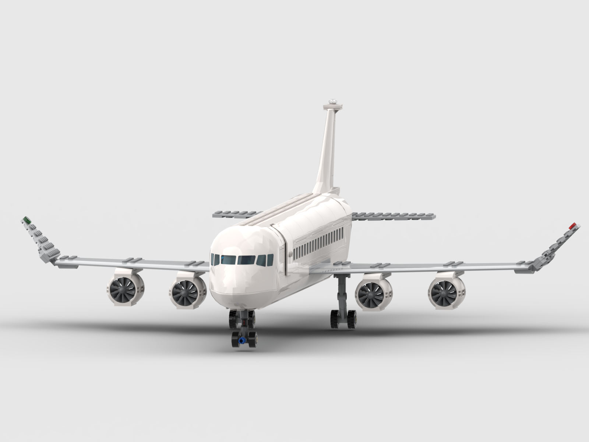
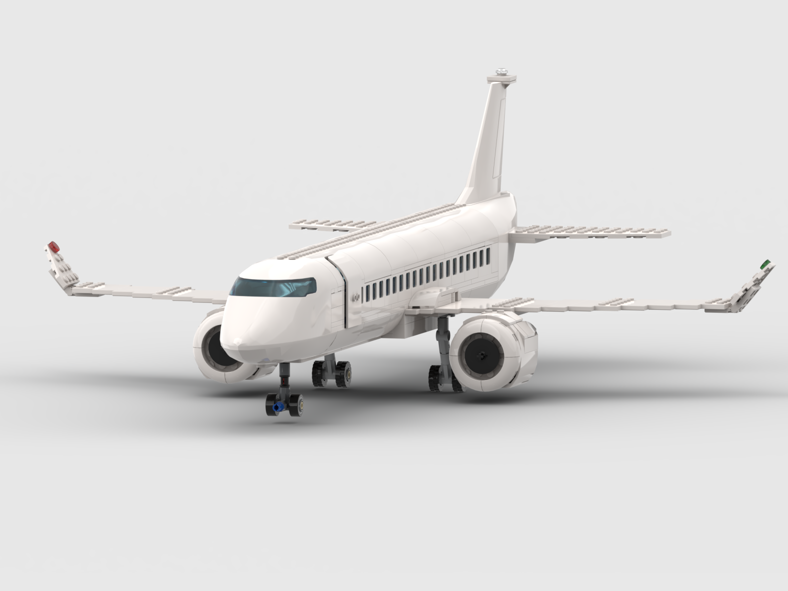

# Lego Finnair Passenger Plane

This passenger plane actually doesn't represent any airliners colours, as it's plain white. For example Finnair uses such colouring with their new brand name logo attached on top of the window row, and an "F" in the tail.

Built with [BrickLink Studio](https://www.bricklink.com/v3/studio).

Licensed under [Creative Commons Attribution 4.0](https://creativecommons.org/licenses/by/4.0/).

## A320

Please see [instructions](./A320/lego-finnair-passenger-plane-a320.pdf) how to build one yourself.

You can upload the [model](./A320/lego-finnair-passenger-plane-a320.io) into BrickLink [wanted list](https://www.bricklink.com/v2/wanted/list.page) to buy the bricks, and built it with real Lego bricks.

## A340

Please see [instructions](./A340/lego-finnair-passenger-plane-a340.pdf) how to build one yourself.

You can upload the [model](./A340/lego-finnair-passenger-plane-a340.io) into BrickLink [wanted list](https://www.bricklink.com/v2/wanted/list.page) to buy the bricks, and built it with real Lego bricks.

## A350

Please see [instructions](./A350/lego-finnair-passenger-plane-a350.pdf) how to build one yourself.

You can upload the [model](./A350/lego-finnair-passenger-plane-a350.io) into BrickLink [wanted list](https://www.bricklink.com/v2/wanted/list.page) to buy the bricks, and built it with real Lego bricks.
